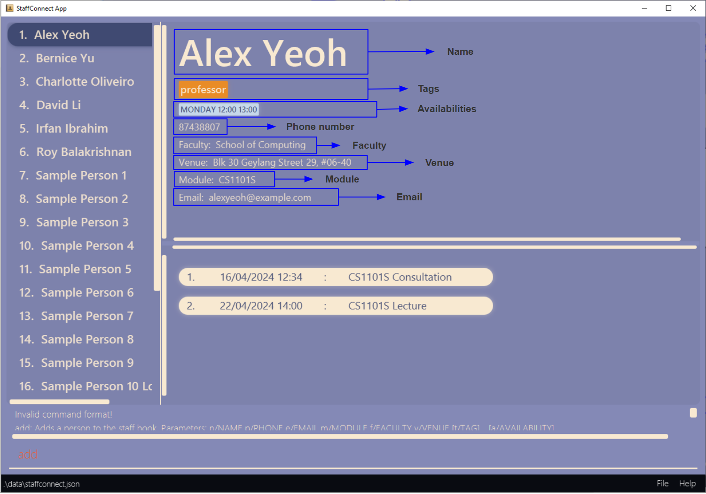
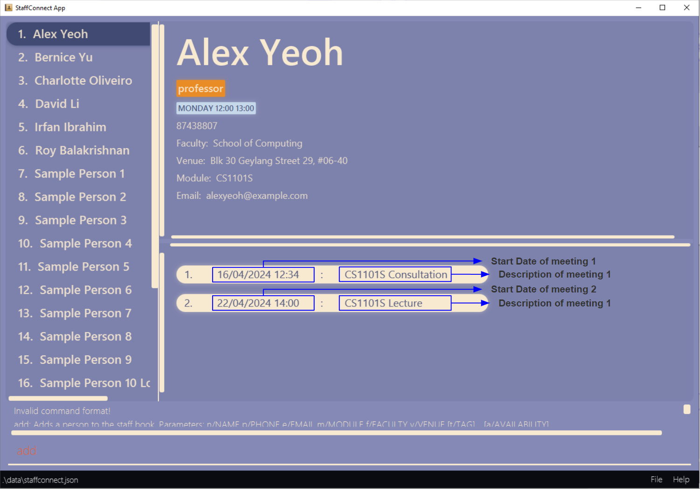
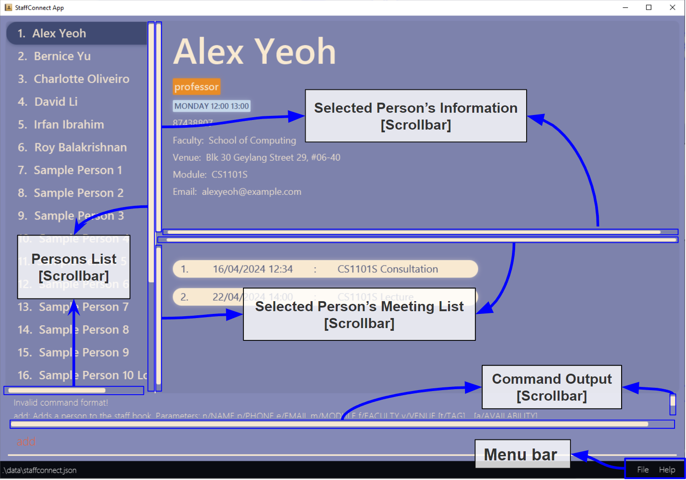

StaffConnect (SC) is a **desktop app for managing Professors' and Tutors' contact information and associated meetings, optimized for use via a Command Line Interface** (CLI) while still having the benefits of a Graphical User Interface (GUI). If you can type fast, SC can get your contact management tasks done faster than traditional GUI apps.

* Table of Contents
{:toc}

--------------------------------------------------------------------------------------------------------------------

## Quick start

1. Ensure you have Java `11` or above installed in your Computer.

2. Download the latest `StaffConnect.jar` from [here](https://github.com/AY2324S2-CS2103-F08-3/tp/).

3. Copy the file to the folder you want to use as the _home folder_ for your StaffConnect application.

4. Open a command terminal, `cd` into the folder you put the jar file in, and use the `java -jar StaffConnect.jar` command to run the application.<br>
   A GUI similar to the below should appear in a few seconds. Note how the app contains some sample data.<br>__(The data in preview image below may not match with the sample data provided)__<br>
   

5. Type the command in the command box and press Enter to execute it. e.g. typing **`help`** and pressing Enter will open the help window.<br>
   Some example commands you can try:

    * `list` : Lists all persons.

    * `add n/John Doe p/98765432 e/johnd@example.com m/CS2103 f/Computing v/John street, block 123, #01-01` : Adds a person named `John Doe` to the persons list.

    * `delete 3` : Deletes the 3rd person shown in the current list.

    * `clear` : Deletes all persons.

    * `exit` : Exits the app.

6. Refer to the [Features](#features) below for details of each command.

--------------------------------------------------------------------------------------------------------------------

## Navigability

### Overall UI layout
<br>

#### [UI] Persons Info
<br>
*Note that the availability will not be displayed in sequential order.
* The values of `Module` will be displayed and stored in capital letters.
* The values of [`Faculty`](#valid-faculty-values) will be stored to their full names.
* The values of `day` part of `Availability` will be stored as their full form such as `MONDAY`, `TUESDAY`, `WEDNESDAY`, `THURSDAY`, `FRIDAY`, `SATURDAY`, `SUNDAY`.

#### [UI] Meeting List
<br>

#### [UI] Scrollbars and Menu
<br>
*Note that Persons List Scrollbar will open appear when the number of Persons in the list exceed the amount to be displayed by the view.
*Note that the `Exit` button is in the dropdown of the `File` button.

### Mouse and Keyboard controls

Before we get started StaffConnect offers a unique suite of UI controls for users to customise their own unique experience!

1. Clicking any items on the left persons list panel will allow you to select the person's attributes and meeting list to display.
<br>Alternatively, clicking anywhere in the persons list panel then using your arrow keys to navigate and hitting enter to select would give the same result.
<br>**Intended Behaviour:** 
<br> Hovering the selection with mouse or arrow keys would not cause the details panel to switch to the selected person. This is to allow users to browse the persons list panel without switching.
<br>
   

2. There is a divider that is draggable up and down to hide and show details on the right side and to customise the look of your application.
<br>

3. Each of the 2 detail panels on the right are able to pan in all four directions to view the content:
    - For mouse pad users, dragging around with two fingers the around would pan around the pane.
    - For mouse users, __[Mouse Wheel]__ will scroll up and down while __[Shift + Mouse wheel]__ will scroll left and right.
    - __[Left click + Drag Mouse]__ would pan around in the details pane as well.
    - Keyboard arrow keys are able to pan around as well, but the scroll speed may differ on different systems.
    - There are scroll bars at the vertical and horizontal dividers of the window pane, dragging them in the respective direction will pan around as well.
   
4.  The Result display:<br>
    The scroll bars can only be scrolled by two ways:
      1. For mouse pad users, dragging around with two fingers the around would pan around the pane.
      2. For mouse users, __[Mouse Wheel]__ will scroll up and down while __[Shift + Mouse Wheel]__ will scroll left and right.
      3. Simply dragging the scroll bar with a left mouse click. 
      <br>**Scrolling by arrow keys is not fully supported in the result display**

5.  The Command box:<br>
    The input can only be scrolled by __[Holding Left Click + Drag Mouse]__  to the edge in the direction to scroll. This is to allow making adjustments on very long commands.


<Br><Br> 
### Alternative UI arrangements
<br>
<br>
<br>

**Intended Limitations**
1. The divider position is not controllable by keyboard input, hence the only way to customise the look is mostly by mouse input.
2. Panel switching by keyboard input, like a terminal is not supported.
3. Font sizes does not automatically resize in this application, scroll bars will appear in smaller window variants of this application to help with the viewing of details.
4. The UI will do a soft reset on its divider position every time the application is relaunched, as this is to allow users who wish to fall back to the default layout settings.


--------------------------------------------------------------------------------------------------------------------


## Features

<div markdown="block" class="alert alert-info">

**:information_source: Notes about the command format:**<br>

* Words in `UPPER_CASE` are the parameters to be supplied by the user.<br>
  e.g. in `add n/NAME`, `NAME` is a parameter which can be used as `add n/John Doe`.

* Items in square brackets are optional.<br>
  e.g `n/NAME [t/TAG]` can be used as `n/John Doe t/friend` or as `n/John Doe`.

* Items with `…`​ after them can be used multiple times including zero times.<br>
  e.g. `[t/TAG]…​` can be used as ` ` (i.e. 0 times), `t/friend`, `t/friend t/family` etc.

* Parameters can be in any order.<br>
  e.g. if the command specifies `n/NAME p/PHONE_NUMBER`, `p/PHONE_NUMBER n/NAME` is also acceptable.

* Extraneous parameters for commands that do not take in parameters (such as `help`, `list`, `exit` and `clear`) will be ignored.<br>
  e.g. if the command specifies `help 123`, it will be interpreted as `help`.

* If you are using a PDF version of this document, be careful when copying and pasting commands that span multiple lines as space characters surrounding line-breaks may be omitted when copied over to the application.
</div>

### Viewing help : `help`

Shows a message explaining how to access the help page.


Format: `help`


### Adding a person: `add`

Adds a person to the staff book.

Format: `add n/NAME p/PHONE_NUMBER e/EMAIL m/MODULE f/FACULTY v/VENUE [t/TAG]…​ [a/AVAILABILITY]…​`

* `NAME` is case-sensitive and has to be unique among persons in staff book.
* `PHONE_NUMBER`, `EMAIL`, `MODULE`, `FACULTY`, `VENUE` do not need to be unique and can be duplicated among persons to staff book.
* `TAG` and `AVAILABILITY` have to be unique for a person but can be duplicated among persons in staff book.

<div markdown="span" class="alert alert-primary">:bulb: **Tip:**
A person can have any number of tags and availabilities (including 0)
</div>

Examples:
* `add n/John Doe p/98765432 e/johnd@example.com f/Computing v/John street, block 123, #01-01 m/CS2103`
* `add n/Chihiro Ogino m/GEC1024 e/spirited@example.com f/FASS v/The Spirit Realm p/20122001 a/tues 21:00 22:00 a/wednesday 00:00 23:59`
* `add n/Betsy Crowe t/friend m/CS2103T e/betsycrowe@example.com f/Computing v/Newgate Prison p/1234567 t/criminal a/monday 11:00 12:00 a/wednesday 14:00 16:00`


### Listing all persons : `list`

Shows a list of all persons in the staff book.

Format: `list`

### Editing a person : `edit`

Edits an existing person in the staff book.

<div markdown="block" class="alert alert-info">

**:information_source: Notes:**<br>

* The displayed view in StaffConnect will reset to the default view after the `edit` command is called.

* The changes made are displayed in the result display above the command box.
</div>

Format: `edit INDEX [n/NAME] [p/PHONE] [e/EMAIL] [m/MODULE] [f/FACULTY] [v/VENUE] [t/TAG]…​ [a/AVAILABILITY]…​`

* Edits the person at the specified `INDEX`. The index refers to the index number shown in the displayed person list. The index **must be a positive integer** 1, 2, 3, …​
* At least one of the optional fields must be provided.
* Existing values will be updated to the input values.
* When editing tags, the existing tags of the person will be removed i.e adding of tags is not cumulative.
* You can remove all the person’s tags by typing `t/` without specifying any tags after it.
* When editing availabilities, the existing availabilities of the person will be removed i.e adding of availabilities is not cumulative.
* You can remove all the person’s availabilities by typing `a/` without specifying any availabilities after it.
* `NAME` is case-sensitive and has to be unique among persons in staff book.
* `PHONE_NUMBER`, `EMAIL`, `MODULE`, `FACULTY`, `VENUE` do not need to be unique and can be duplicated among persons in staff book.
* `TAG` and `AVAILABILITY` have to be unique for a person but can be duplicated among persons in staff book.

Examples:
*  `edit 1 p/91234567 e/johndoe@example.com` Edits the phone number and email address of the 1st person to be `91234567` and `johndoe@example.com` respectively.
*  `edit 3 m/GEA1000` Edits the module of the 3rd person to be `GEA1000`.
* `edit 2 n/Betsy Crower t/` Edits the name of the 2nd person to be `Betsy Crower` and clears all existing tags.
    <br>**Before editing the second person:** <br>
    
    <br>
    <br>**After editing the second person:** <br>
    

### Locating persons by name: `find`

Finds persons whose names contain any of the given keywords.

Format: `find KEYWORD [MORE_KEYWORDS]`

* The search is case-insensitive. e.g `hans` will match `Hans`
* The order of the keywords does not matter. e.g. `Hans Bo` will match `Bo Hans`
* Only the name is searched.
* Only full words will be matched e.g. `Han` will not match `Hans`
* Persons matching at least one keyword will be returned (i.e. `OR` search).
  e.g. `Hans Bo` will return `Hans Gruber`, `Bo Yang`

Examples:
* `find John` returns `john` and `John Doe`
* `find li` returns `David Li`
* `find alex david` returns `Alex Yeoh`, `David Li`<br>
  

### Filtering persons: `filter`

Filters persons whose module, faculty, tags or availabilities match the given filtering criteria.

format: `filter [m/MODULE] [f/FACULTY] [t/TAG]… [a/AVAILABILITY]…`

* At least one of the optional fields must be provided.
* Only module, faculty, tags and availabilities can be filtered.
* The filter only accepts a single module to filter from.
* The filter only accepts a single faculty to filter from.
* The filter only accepts valid values for faculty. e.g `faculty of business` is an invalid faculty value.
* The filter accepts single or multiple tags to filter from.
* The filter accepts single or multiple availabilities to filter from.
* The filter only accepts whole values for the available filtering criteria. e.g `mon` does not match `mon 12:00 13:00`, `cs` does not match `CS2030S`
* The filter is case-insensitive for the available filtering criteria. e.g `tUTOR` will match `tutor`, `cs2100` will match `CS2100`
* Persons matching all fields will be returned (i.e. `AND` search).
  e.g. `filter m/CS2030S f/Computing` will return `Charlotte Oliveiro`

Examples:
* `filter m/CS1101S` returns `Alex Yeoh`
* `filter f/Computing t/professor` returns `Alex Yeoh`, `Charlotte Oliveiro`, `David Li` and `Roy Balakrishman`
* `filter t/tutor` returns `Bernice Yu`, `Irfan Ibrahim`<br>
  


### Sorting persons: `sort`

Sorts the list of persons based on specified attribute.

Format: `sort [n/] [p/] [m/] [f/] [v/] [s/] [meet/]`

* By default, sorting is done in alphanumeric order.
* The order of character priority would be letters (A-Z), numbers (0-9), special characters (!@#$%^&*).
* The capitalisation of the letters do not affect their priority such that `Aaron` will have same priority as `aaron`.
* For attribute with exact same values, the tie-breaker is determined by their added order.
* For sorting of multiple attributes, the weightage will be determined by the order in which it was entered. E.g `sort m/ p/ v/` will sort persons by their module, among those with equal modules would then be sorted by their phone number and similarly for venue.
* `s/` sorts the list by person with the earliest meeting
* `meet/` sorts the list by person with the earliest meeting, followed by alphanumeric order of meeting description

Examples:
* `sort m/ p/` returns person by ascending module codes followed by ascending phone numbers `CS2000 80000000`, `CS2000 90000000`, `CS3000 80000000`followed by `CS3000 90000000`
* `sort n/` returns person by ascending names `Alex`, `Bernice` followed by `Charlotte`
* `sort p/` returns person by ascending phone numbers `87438807`, `91031282` followed by `92492021`<br>
  

### Adding a meeting to a person: `meeting-add`

Add a meeting to a person based on specified description and date.

Format: `meeting-add INDEX d/DESCRIPTION s/DATETIME`

* Adds a meeting to the person at the specified `INDEX`. The index refers to the index number shown in the displayed person list. The index **must be a positive integer** 1, 2, 3,…​ and tally within range index of the displayed list.
* Both of the fields must be provided and valid values.
* A valid `DESCRIPTION` of the meeting can only contain latin alphanumeric characters and is case-sensitive.
* A valid `DATETIME` of the meeting can only contain valid date and 24 hour time values with a single space to separate the date and time. Multiple formats are allowed.
    * Date Formats
        - Separators: `-`
            1. `d-M-yyyy`
            2. `dd-M-yyyy`
            3. `d-MM-yyyy`
            4. `dd-MM-yyyy`
            5. `yyyy-M-d`
            6. `yyyy-MM-d`
            7. `yyyy-MM-dd`
        - Separators: `/`
            1. `d/M/yyyy`
            2. `dd/M/yyyy`
            3. `d/MM/yyyy`
            4. `dd/MM/yyyy`
            5. `yyyy/M/d`
            6. `yyyy/M/dd`
            7. `yyyy/MM/d`
            8. `yyyy/MM/dd`
    * Time Formats
        1. `HH:mm`
        2. `H:mm`
        3. `HHmm`
* Duplicate meetings with the same `DESCRIPTION` and `DATETIME` for the same person is not allowed. `DESCRIPTION` only matches its duplicate when both case sensitivity matches.
* Meetings with the same `DESCRIPTION` and `DATETIME` does not need to be unique among persons in staff book.
* StaffConnect does not limit the flexibility for users, hence the user is able to add any meeting at any point of time and even meetings of different topics at the same time.

Examples:
* `meeting-add 1 d/Meet for finals preparation s/12/04/2024 18:00` adds a meeting to the first person with the description of `Meet for finals preparation` and the date and time of `12/04/2024 18:00`
* `meeting-add 1 d/CS2100 Consultation s/11/06/2024 08:00` adds a meeting to the first person with the description of `CS2100 Consultation` and the date and time of `11/06/2024 08:00`
* `meeting-add 2 d/Meet for practical exam s/20/04/2024 15:00` adds a meeting to the second person with the description of `Meet for practical exam` and the date and time of `20/04/2024 15:00`

<br>**Result for add meeting:** <br> `meeting-add 1 d/Meet for finals preparation s/12/04/2024 18:00`<br>
  

### Deleting a meeting from a person: `meeting-delete`

<div markdown="block" class="alert alert-danger">:warning: **Caution:**
There will be no further prompt after entering the command to delete a meeting from a person. This action is irreversible and the meeting information to be deleted cannot be retrieved afterwards.
</div>

Deletes a meeting from a person based on specified meeting index.

Format: `meeting-delete INDEX i/MEETING-INDEX `

* Deletes the  meeting at specified `MEETING-INDEX` from the person at specified `INDEX`. 
* The index refers to the index number shown in the displayed person list. 
* The index **must be a positive integer** 1, 2, 3,…​ and tally within range index of the displayed person list.
* The meeting-index refers to the index number shown in the displayed meeting list.
* The meeting-index **must be a positive integer** 1, 2, 3,…​ and tally within range index of the displayed meeting list.
* The meeting from the person must exist before it can be deleted otherwise an error will be displayed.

Examples:
<br>The following commands assumes that meetings have been added prior to the command. Otherwise, an error will be thrown. <br> **(Refer to the section above on how to add a meeting)**
* `list` followed by `meeting-delete 1 i/1` deletes the 1st meeting from the 1st person in the list.
* `meeting-delete 1 i/3` deletes the 3rd meeting from the 1st person in the current displayed contacts list.
* `find Bernice Yu` followed by `meeting-delete 1 i/2` deletes the 1st meeting from the 1st person in the results of the `find` command.
      
<br>**Results for delete meeting:**<br>
The following command was applied:  `find Bernice Yu` followed by `meeting-delete 1 i/2`.
<br> __(Disclaimer: The content shown in the examples may not match what you have added to your own meetings within the staff book).__
<br><br> **After `find Bernice Yu`:**<br>
    
<br><br> **After `meeting-delete 1 i/2`:**<br>
    
<br><br> **After `meeting-delete 1 i/1`:**<br>
    

### Deleting a person : `delete`

<div markdown="block" class="alert alert-danger">:warning: **Caution:**
There will be no further prompt after entering the command to delete a person in the staff book. This action is irreversible and the person to be deleted cannot be retrieved afterwards.
</div>

Deletes the specified person from the staff book.

Format: `delete INDEX`

* Deletes the person at the specified `INDEX`.
* The index refers to the index number shown in the displayed person list.
* The index **must be a positive integer** 1, 2, 3, …​

Examples:
* `list` followed by `delete 2` deletes the 2nd person in the list.
* `sort p/` followed by `delete 1` deletes the 1st person in the list in the results of the `sort` command, which should be the person with the smallest phone number.
* `find Bernice Yu` followed by `delete 1` deletes the 1st person in the results of the `find` command.
  <br>**Before deletion:**<br>
  
  <br>**First find Bernice:**<br>
  
  <br>**Then delete Bernice:**<br>
  
  <br>**List all persons and Bernice is deleted:**<br>
  

### Setting a person as favourite: `fav`

Sets the specified person from the list as favourite.

<div markdown="block" class="alert alert-info">:information_source: **Note:**
The displayed view in StaffConnect will reset to the default view after the `fav` command is called.
</div>

Format: `fav INDEX`

* Sets the person at the specified `INDEX`.
* The index refers to the index number shown in the displayed person list.
* The index **must be a positive integer** 1, 2, 3, …​

Examples:
* `list` followed by `fav 2` sets the 2nd person as favourite in the staff book.
* `sort p/` followed by `fav 1` sets the 1st person as favourite in the staff book in the results of the `sort` command, which should be the person with the smallest phone number.
* `find Betsy` followed by `fav 1` sets the 1st person as favourite in the results of the `find` command.


### Removing a person as favourite: `unfav`

Removes the specified person from the staff book as favourite.

<div markdown="block" class="alert alert-info">:information_source: **Note:**
The displayed view in StaffConnect will reset to the default view after the `unfav` command is called.
</div>

Format: `unfav INDEX`

* Removes the person at the specified `INDEX`.
* The index refers to the index number shown in the displayed person list.
* The index **must be a positive integer** 1, 2, 3, …​

Examples:
* `list` followed by `unfav 2` removes the 2nd person as favourite in the staff book.
* `sort p/` followed by `fav 1` removes the 1st person as favourite in the staff book in the results of the `sort` command, which should be the person with the smallest phone number.
* `find Betsy` followed by `unfav 1` removes the 1st person as favourite in the results of the `find` command.

### Refreshing and clearing all outdated meetings: `refresh`

<div markdown="block" class="alert alert-danger">:warning: **Caution:**
This may result in possible data loss. e.g. Meetings of a person may be deleted.
There will be no further prompt after entering the command to refresh meetings of all persons. This action is irreversible and the meeting information that may be deleted cannot be retrieved afterwards.
</div>

Deletes all meetings that start before the very moment the user types in the command and enters.

Format: `refresh`

* The deleted meetings will be explicitly printed again to the use, specifying content of the meeting and who "owns" the meeting.
* If no meetings are deleted, there will no error thrown. Instead, a prompt will be given to user that no meeting is deleted.

Examples:
* If there is a meeting `Avengers Assemble` that happened in `31/08/1939 12:00`, when the user types in `refresh`, it will be deleted.
* If there is a meeting `French Revolution` that happened in `14/07/1789 12:00`, when the user types in `refresh`, it will be deleted.
* If there is a meeting `Future Meeting` that will happen in `31/12/2999 12:00`, when the user types in `refresh`, it will not be deleted.
  <br>**Before:**<br>
  
  <br>**After:**<br>
  

**Known limitations:**
Refresh is only used when the user decides to remove clutter in the staff book, and wants to remove outdated meetings. 
This process is not done automatically as sometimes the user would like to retain old meetings for bookkeeping purposes.

### Selecting the person to display: `select`

Selects the person identified by their current displayed index number to display their attributes and meeting list.

Format: `select INDEX`

* Select the person at the specified **INDEX** to display its attributes and meeting list.
* The index refers to the index number shown in the current displayed person list.
* The index **must be a positive integer** 1, 2, 3, …​

Examples:
* `list` followed by `select 2`. <br> Selects the 2nd person in the staff book.
* `filter t/tutor` followed by `select 1` <br> Selects the 1st person in the results of the `filter` command.
* `sort p/` followed by `select 1` <br> Selects the 1st person in the results of the `sort` command, which should be the person with the smallest phone number.

### Clearing all entries : `clear`

<div markdown="block" class="alert alert-danger">:warning: **Caution:**
There will be no further prompt after entering the command to clear all persons from the staff book. This action is irreversible and the staff book cannot be retrieved afterwards.
</div>

Clears all entries from the staff book.

Format: `clear`


### Exiting the program : `exit`

Exits the program.

Format: `exit`

### Saving the data

StaffConnect data are saved in the hard disk automatically after any command that changes the data. There is no need to save manually.

### Editing the data file

StaffConnect data are saved automatically as a JSON file `[JAR file location]/data/staffconnect.json`. Advanced users are welcome to update data directly by editing that data file.

<div markdown="span" class="alert alert-warning">:exclamation: **Caution:**
If your changes to the data file makes its format invalid, StaffConnect will discard all data and start with an empty data file at the next run. Hence, it is **recommended to take a backup** of the file before editing it.<br>
Furthermore, certain edits can cause StaffConnect to behave in unexpected ways (e.g., if a value entered is outside of the acceptable range). 
The application will not prompt the user if the format of the data file is incorrect, but instead provide the user with an empty staff book.<br>
**Therefore, edit the data file only if you are confident that you can update it correctly.**

</div>

#### Valid Data Values for `Person` in JSON file

All attributes' restrictions except **Favourite** can be found in the [Attribute Summary](#attribute-summary) table.

Attribute | Data Field | Valid Data Values
----------|--------|-------------
Name | `name` | `Alice`, `Ben10`
Phone | `phone` | `123`, `98765432`
Email | `email` | `e@123.com`, `hello@h-h.com`, `one+two@h-h.hh`, `hello@e-h.e-hh`
Module | `module` | `gess1025`, `hsi1000`, `CS2103T`
Faculty | `faculty` | Refer to the [Valid Faculty Values](#valid-faculty-values) table.
Venue | `venue` | `COM4-02-33`, `LT21`, `Kent Ridge Vale, Tulip Street, #12-34`
Tag | `tags` | `professor`, `Number1TA`
Availabilitity | `availabilities` | `TUESDAY 12:00 13:00`, `WEDNESDAY 12:00 13:00`
Meeting | `meetings` | Refer to the [Valid Data Values in meetings](#valid-data-values-for-meetings-for-each-person-in-json-file) table.
Favourite | `favourite` | `Favourite` or `Not favourite`

#### Valid Data Values for `Meetings` (for each `Person`) in JSON file

Attribute | Meeting Data Fields | Valid Values
----------|--------|-------------
Meeting Description | `description` | `Meeting 1`, `Finals`
Meeting Start Time | `date` | `30/1/2024 12:12`, `2002-11-15 19:00`, `1-12-2022 9:00`, `2024/1/1 0000`

<div markdown="block" class="alert alert-primary">

**:exclamation: Important:**

* The value of `favourite` data field is case-sensitive.
  * :heavy_check_mark: `Not favourite`
  * :x: `not favourite`
  * :x: `not FAVOURITE`
* There cannot be duplicates of
  * `meeting` (exact same pair of `description` and `date`) in each `person`.
  * `name` in the staff book.

</div>

#### Sample Data File Content

```json
{
  "persons" : [ {
    "name" : "Alex Yeoh",
    "phone" : "87438807",
    "email" : "alexyeoh@example.com",
    "module" : "CS1101S",
    "faculty" : "School of Computing",
    "venue" : "Blk 30 Geylang Street 29, #06-40",
    "tags" : [ ],
    "availabilities" : [ ],
    "meetings" : [ ],
    "favourite" : "Not favourite"
  }, {
    "name" : "John Smith",
    "phone" : "99272758",
    "email" : "johnsmith@example.com",
    "module" : "CS2103S",
    "faculty" : "School of Computing",
    "venue" : "Blk 30 Lorong 3 Serangoon Gardens, #07-18",
    "tags" : [ "friends", "tutor" ],
    "availabilities" : [ "TUESDAY 12:00 13:00", "WEDNESDAY 12:00 13:00" ],
    "meetings" : [ {
      "description" : "test",
      "date" : "12/12/2024 12:12"
    }, {
      "description" : "test2",
      "date" : "10/10/2024 10:10"
    } ],
    "favourite" : "Favourite"
  } ]
}
```

--------------------------------------------------------------------------------------------------------------------

## FAQ

**Q**: How do I transfer my data to another Computer?<br>
**A**: Install the app in the other computer and overwrite the generated data file with the file that contains the data from your current StaffConnect device.<br>
**Q**: Why are concurrent or past meetings allowed? <br>
**A**: This is to allow greater flexibility for users who wish to segregate meetings of different topics happening concurrently or users who wish to store meetings in the past for bookkeeping purposes etc..
**Q**: Why are meeting's description with the same content but different case-sensitivity allowed?
**A**: Sometimes the user would like to have finer control over how they want to differentiate between topics, and a single capital letter could make that difference.

--------------------------------------------------------------------------------------------------------------------

## Known issues

1. **When using multiple screens**, if you move the application to a secondary screen, and later switch to using only the primary screen, the GUI will open off-screen. The remedy is to delete the `preferences.json` file created by the application before running the application again.
2. **When adding/editing phone number with a descriptor**, If you try to add a number with a descriptor such as `98731094 (home)`, the application rejects this input and advise the user to only provide phone numbers with numerical values only. The phone number is not intended to store phone number descriptor but users can consider using tags such as t/homePhone as a workaround.
3. **When adding/editing name containing special characters**, If you try to add a name such as `Jason s/o William`, the application rejects this input and advise the user to only provide name with alphanumeric values only. The name is not intended to store special characters but users can consider using `so` or `son of` as a workaround. If a person's name includes special characters (characters not included in modern English) like arabic characters (such as أ, ب, ت, etc.), it should be latinized first.
4. **When adding/editing name that already exists in the staff book**, if you try to do so, an error message will be prompted, as two persons are considered the same person as long as they have the same name. It is inplausible to has two persons with the same name but other different attributes.
5. **When adding/editing venues containing space with an attribute prefix**, If you try to add a venue such as `Room 12 t/r`, the application will add a person with a venue `Room 12` and a tag `r` instead of the intended venue `Room 12 t/r`. The venue is not intended to store venues that contains a space followed by an attribute prefix but users can consider omitting the space or replace with a hyphen such as `Room 12t/r` or `Room 12-t/r` as a workaround.
6. **When generating the default file and exiting via the `Exit` button**, If you try to generate the default JSON file `[JAR file location]/data/staffconnect.json` by running the JAR file, without manipulating any data and exiting via the `Exit` button, the JSON file would not be generated. You may consider using the `exit` command via the command line interface to generate the default JSON file instead.


--------------------------------------------------------------------------------------------------------------------

## Attribute summary

Attribute | Prefix | Restrictions | Examples
----------|--------|--------------|---------------------
Name[^1] | n/ | Case-sensitive.<br>Only alphanumeric characters allowed. Spaces are only allowed between alphanumeric characters. | `alex yeoh`, `Bernice Yu`, `test1`
Phone Number[^1] | p/ | Numeric digits only, no special characters, at least 3 digits long. | `123`, `88888888, 12345678`
Email[^1] | e/ | Valid email of the format `local-part@domain`.<br>1. `local-part` should only contain alphanumeric characters and the special characters `+_.-`<br>2. `local-part` may not start or end with any special characters.<br>3. `local-part` must be followed by exactly one `@` and then a `domain` name.<br>4. `domain` must be made up of at least 2 `domain` labels separated by periods.<br>5. Each `domain` name must be at least 2 alphanumeric characters long.<br>6. Each `domain` name must start and end with alphanumeric characters.<br>7. Each `domain` name can only consist of alphanumeric characters, separated by hyphens, if any. | `e@123.com`, `hello@h-h.com`, `one+two@h-h.hh`, `hello@e-h.e-hh`
Module[^1] | m/ | Case-insensitive.<br>Valid module consisting of 2-4 letters, followed by exactly 4 numeric digits, with a suffix that is at most 2 characters long. | `gess1025`, `hsi1000`, `cs2103t`
Faculty[^1] | f/ | Case-insensitive.<br>Restricted set of values (refer to [Valid Faculty Values](#valid-faculty-values) below).<br>A valid faculty name and its variations (other names) all refer to the same faculty. | `soc`, `biz`, `School of Business`
Venue[^1] | v/ | Any characters allowed.<br>Cannot be empty. | `belobog avenue`, `COM4-02-33`, `LT21`, `Kent Ridge Vale, Tulip Street, #12-34`
Tag | t/ | Case-sensitive.<br>Only alphanumeric characters allowed.<br>Person can have any number of tags. | `tutor`, `professor`, `BestProf`, `Number1TA`
Availability | a/ | Valid format of `day start-time end-time`.<br>Person can have any number of availabilities.<br>1. `day` should be a valid day of week: `Monday`, `mon`, `Tuesday`, `tue`, `tues`, `Wednesday`, `wednes`, `wed`, `Thursday`, `thurs`, `thur`, `thu`, `Friday`, `fri`, `Saturday`, `satur`, `sat`, `Sunday`, `sun`.<br>2. `day` is case-insensitive.<br>3. `start-time` and `end-time` should be in the time format of `HH:mm` where `HH` is in 24 hours (00-23) and `mm` are valid minutes (00-59). | `mon 13:00 14:00`, `monday 13:00 14:00`, `tues 14:00 21:00`
Meeting Description | d/ | Case-sensitive.<br>Only alphanumeric characters allowed. Spaces are only allowed between alphanumeric characters. | `Meet for finals`, `Midterm revision`
Meeting Start Time | s/ | Valid date and time format.<br>1. Valid date formats: `yyyy-MM-dd`, `yyyy-M-d`, `dd-MM-yyyy`, `yyyy-MM-d`, `d-MM-yyyy`, `d-M-yyyy`, `dd-M-yyyy`, `d/MM/yyyy`, `d-M-yyyy`, `dd-M-yyyy`, `dd/MM/yyyy`, `yyyy/MM/dd`, `yyyy/MM/d`, `yyyy/M/dd`,  `yyyy/M/d`<br>where `yyyy` is a 4-digit year (0000-9999), `M` is a single digit month (1-9), `MM` is a valid month (01-12), `d` is a single digit day (1-9), `dd` is a valid day (01-31)<br>2. Valid time formats: `HH:mm`, `H:mm`, `HHmm`<br>where `H` is a single digit hour (1-9), `HH` is a valid 24-hour (00-23), `mm` are valid minutes (00-59). | `2002-11-02 19:00`, `1-12-2022 9:00`, `2024/1/1 0000`

[^1]: These are mandatory attributes when adding a person into the staff book, as these are important information for students to know when/where to consult their professors/TAs.

### Valid `Faculty` Values

Faculty | Other names
--------|------
Faculty of Arts of Social Sciences | Arts and Social Sciences, FASS
Business School | Business, Biz School, Biz
School of Computing | Computing, SoC
School of Continuing and Lifelong Education | Continuing and Lifelong Education, SCALE
Faculty of Dentistry | Dentistry
College of Design and Engineering | Design and Engineering, CDE
Duke-NUS Medical School | Duke-NUS
Integrative Sciences and Engineering | ISEP
Faculty of Law | Law
Yong Loo Lin School of Medicine | Medicine
Yong Siew Toh Conservatory of Music | Music, TST Conservatory of Music
Saw Swee Hock School of Public Health | Public Health
Lee Kuan Yew School of Public Policy | Public Policy, LKY School of Public Policy
Faculty of Science | Science, FoS
University Scholars Programme | USP
Yale-NUS College | Yale-NUS

--------------------------------------------------------------------------------------------------------------------

## Command summary

Action | Format, Examples
--------|------------------
**Add** | `add n/NAME p/PHONE_NUMBER e/EMAIL m/MODULE f/FACULTY v/VENUE [t/TAG]…​ [a/AVAILABILITY]…​` <br> e.g., `add n/James Ho p/22224444 e/jamesho@example.com m/CS2103 f/Computing v/123, Clementi Rd, 1234665 t/friend t/colleague a/monday 14:00 16:00`
**Delete** | `delete INDEX`<br> e.g., `delete 3`
**Edit** | `edit INDEX [n/NAME] [p/PHONE_NUMBER] [e/EMAIL] [m/MODULE] [f/FACULTY] [v/VENUE] [t/TAG]…​ [a/AVAILABILITY]…​`<br> e.g.,`edit 2 n/James Lee e/jameslee@example.com`
**Filter** | `filter [m/MODULE] [f/FACULTY] [t/TAG]… [a/AVAILABILITY]…`<br> e.g., `filter m/CS2100 t/friends`
**Find** | `find KEYWORD [MORE_KEYWORDS]`<br> e.g., `find James Jake`
**Sort** | `sort [n/] [p/] [m/] [f/] [v/] [s/] [meet/]...`<br> e.g., `sort n/ p/ m/`
**Add Meeting** | `meeting-add INDEX d/DESCRIPTION s/DATETIME`<br> e.g., `meeting-add 1 d/Meet for finals preparation s/12/04/2024 18:00`
**Delete Meeting** | `meeting-delete INDEX i/MEETING-INDEX`<br> e.g., `meeting-delete 1 i/1 `
**Set as Favourite** | `fav INDEX`<br> e.g., `fav 3`
**Remove as Favourite** | `unfav INDEX`<br> e.g., `unfav 3`
**Select** | `select INDEX`<br> e.g., `select 3`
**Clear** | `clear`
**Refresh** | `refresh`
**List** | `list`
**Help** | `help`
**Exit** | `exit`
